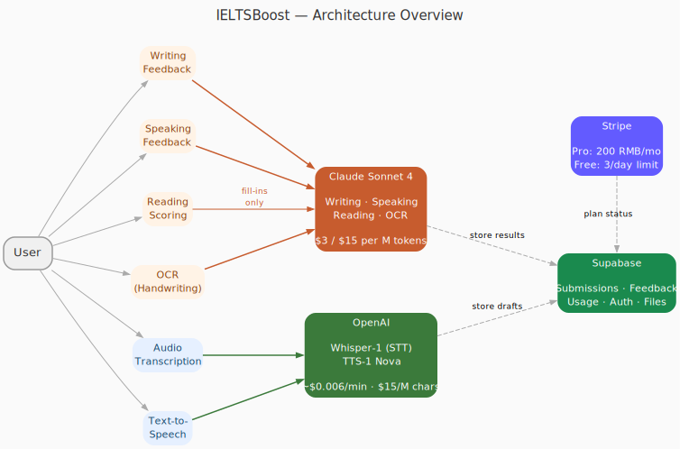

## What is IELTS-Boost?

This is a service to help learners prepare for the IELTS exam. Users can develop their skills across Listening, Reading, Writing, and Speaking using the following cycle:

1. Practice with real questions from previous IELTS exams
2. Receive personalize AI feedback, along with a band score
3. Track your progress using the history, and personalized dashboard, then repeat  

## IELTS Structure

<a href="https://www.youtube.com/watch?v=tOFm-zoI6-w"></a>

IELTS has 4 sections:

 * Listening — 4 parts, 40 questions, ~30 minutes. You listen to recordings (conversations, monologues) and answer questions.
 * Reading — 3 passages, 40 questions, 60 minutes. Academic version uses complex texts; General Training uses more everyday content.
 * Writing — 2 tasks, 60 minutes. Academic: describe a graph/chart + write an essay. General Training: write a letter + an essay.
 * Speaking — 3 parts, 11–14 minutes. A face-to-face interview with an examiner: intro/interview, a short talk on a topic, then a discussion.

## Site Structure

Users can develop their skills within each of the 4 categories using the following cycle

1. Answer questions


## Architecture



| Component | Model | Pricing |
|-----------|-------|---------|
| Writing Feedback | Claude Sonnet 4 | $3 / $15 per M tokens |
| Speaking Feedback | Claude Sonnet 4 | $3 / $15 per M tokens |
| Reading Scoring (fill-ins) | Claude Sonnet 4 | $3 / $15 per M tokens |
| OCR (handwriting) | Claude Sonnet 4 | $3 / $15 per M tokens |
| Audio Transcription | OpenAI Whisper-1 | ~$0.006 per minute |
| Text-to-Speech | OpenAI TTS-1 (Nova) | $15 per M characters |

Reading MCQ, True/False/Not Given, and matching questions are scored deterministically (no AI cost).

## Getting Started

This is a [Next.js](https://nextjs.org) project bootstrapped with [`create-next-app`](https://nextjs.org/docs/app/api-reference/cli/create-next-app).

First, run the development server:

```bash
npm run dev
# or
yarn dev
# or
pnpm dev
# or
bun dev
```

Open [http://localhost:3000](http://localhost:3000) with your browser to see the result.

You can start editing the page by modifying `app/page.tsx`. The page auto-updates as you edit the file.

This project uses [`next/font`](https://nextjs.org/docs/app/building-your-application/optimizing/fonts) to automatically optimize and load [Geist](https://vercel.com/font), a new font family for Vercel.

## Learn More

To learn more about Next.js, take a look at the following resources:

- [Next.js Documentation](https://nextjs.org/docs) - learn about Next.js features and API.
- [Learn Next.js](https://nextjs.org/learn) - an interactive Next.js tutorial.

You can check out [the Next.js GitHub repository](https://github.com/vercel/next.js) - your feedback and contributions are welcome!

## Deploy on Vercel

The easiest way to deploy your Next.js app is to use the [Vercel Platform](https://vercel.com/new?utm_medium=default-template&filter=next.js&utm_source=create-next-app&utm_campaign=create-next-app-readme) from the creators of Next.js.

Check out our [Next.js deployment documentation](https://nextjs.org/docs/app/building-your-application/deploying) for more details.
